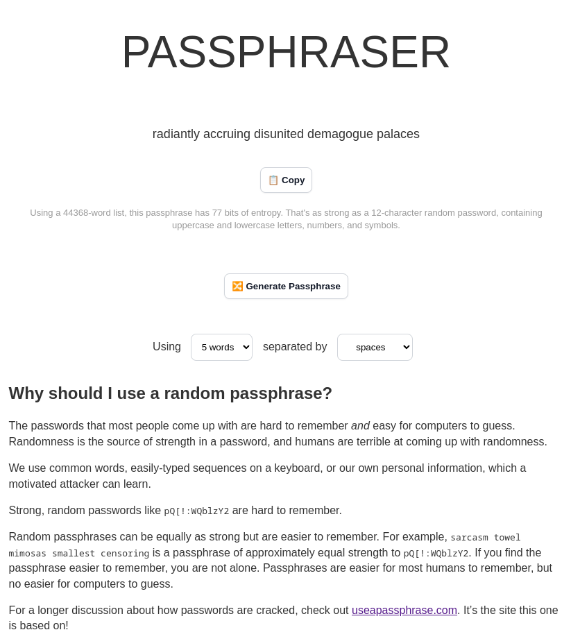
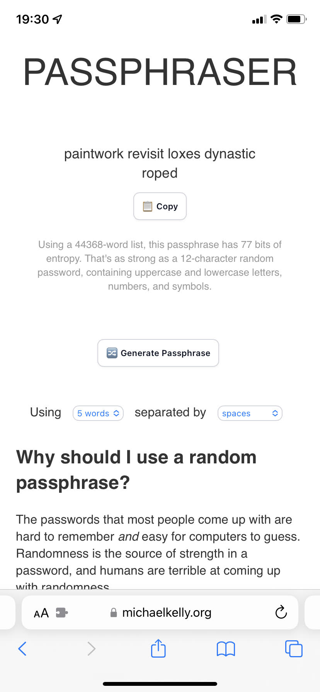

# Passphraser

A self-contained Javscript passphrase generator. Philosophically, it is heavily
inspired by [Use a Passphrase](https://www.useapassphrase.com/).

You can view this page online at:
<https://www.michaelkelly.org/passphraser.html>

*The canonical location of the source code is
<https://git.sr.ht/~mkelly/passphraser>. GitHub is a mirror.*

## Screenshots

This is what it looks like on desktop and mobile:






## Building

Requires Hugo: https://gohugo.io/getting-started/quick-start/

To show a local preview, run `hugo serve`

To generate files in the `public` directory, run `hugo`

## Bias checks

Requires python 3 with numpy: `pip3 install numpy`

There is an alternate endpoint, `/benchmark.html`, which outputs only numerical
indices (which we would normally use to index into our word list). We output 5
per line, and show 100,000 lines. This lets you copy and paste the output and
run whatever tests you want.

`bias-checks.py` has some numerical checks I thought of.

## Word list

The word list is in `assets/wordlist.js`. It's a formatted javascript list. If
you want to export it to plaintext, you can run this from the top-level
directory of this git repo:

```
./scripts/wordlist_to_txt.pl < assets/wordlist.js > wordlist.txt
```

This will give you a `wordlist.txt`.

## Licenses

1. The list of words used is public domain; it is a processed list of words
   ultimately from <https://en.wikipedia.org/wiki/Moby_Project>.
2. Everything else (the code) is covered by the MIT license. See `LICENSE`.
