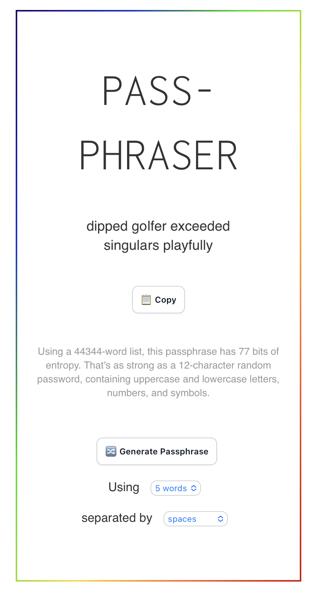

# Passphraser

A single-page passphrase app heavily inspired by [Use a
Passphrase](https://www.useapassphrase.com/).

You can view this page online at: https://www.michaelkelly.org/passphraser.html

## Screenshots

This is what it looks like on desktop and mobile:

## Building

Requires Hugo: https://gohugo.io/getting-started/quick-start/

To show a local preview, run `hugo serve`

To generate files in the `public` directory, run `hugo`

## Bias checks

Requires python 3 with numpy: `pip3 install numpy`

There is an alternate endpoint, `/benchmark.html`, which outputs only numerical
indices (which we would normally use to index into our word list). We output 5
per line, and show 100,000 lines. This lets you copy and paste the output and
run whatever tests you want.

`bias-checks.py` has some numerical checks I thought of.
